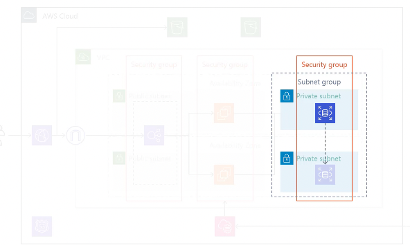

# terraform_aws_Iac

## 作成するアプリケーション

## 作成するVPC
### サブネット
作成するサブネットは以下の４つ
* (Pubilc Subnet) 192.168.1.0/24
* (Pubilc Subnet) 192.168.2.0/24
* (Private Subnet) 192.168.3.0/24
* (Private Subnet) 192.168.4.0/24

### ルートテーブル
作成するルートテーブルは以下の2つ
* public network
* private network

### 作成するインターネットゲートウェイ

## 作成するセキュリティグループ

作成するセキュリティグループは以下の４つ

* Webサーバー用  
  → http/httpsが入ってくる  
  ← TCP3000（アプリケーションサーバー）が出ていく
* APサーバー用  
  → TCP3000が入ってくる  
  ← http/httpsがS3に出ていく  
  ← Mysql向けポート(TCP3306)に出ていく  
*  DBサーバー用  
  → Mysql向けポート(TCP3306)が入ってくる
* 運用管理用  
  → SSHが入ってくる  
  → TCP3000が入ってくる  
  ← HTTP/HTTPSが出ていく

  

### プレフィックスリスト
  S3向けのプレフィックスリストを取得

  

## 作成するRDS

### パラメータグループ

### オプショングループ

### サブネットグループ

## 作成するEC2 (app server)
* Amazon Linux 2
* パブリックサブネット
* セキュリティグループ（APPサーバ用、運用管理用）

### AMIの追加

### キーペアの作成

## 作成するIAMロール

### ポリシーの作成
* AmazonSSMManagedInstanceCore = SessionManagerを使った接続
* AmazonS3ReadOnlyAccess = S3からファイル取得
* AmazonEC2ReadOnlyAccess = EC2のタグ情報取得
* AmazonSSMReadOnlyAccess = Parameter storeから環境変数取得

### インスタンスプロフィールの作成

## 作成するEC2(app server)２回目

### ssm_parameterにDB接続先情報を保存

### 手動でamiの作成

## 作成するELB

### ターゲットグループの作成

### リスナーの作成